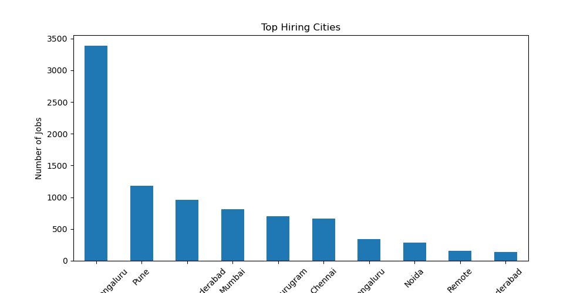
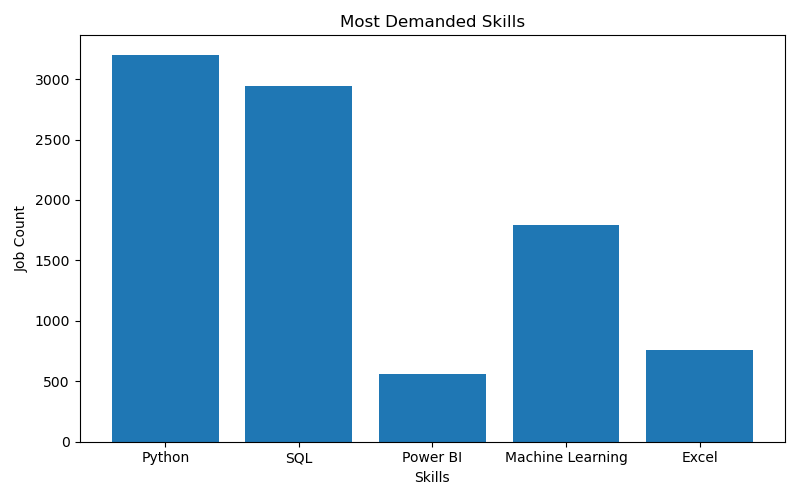

\# Indian Tech Job Market Analyzer

\## Project Overview

This project analyzes trends in the Indian tech job market using Python.

The project focuses on:

\- Top hiring cities

\- Most demanded skills

\- Experience requirements

\- Top hiring companies

\- Most common job roles

\---

\## Technologies Used

\- Python

\- Pandas

\- NumPy

\- Matplotlib

\- Jupyter Notebook

\---

\## Key Insights

\- Python and SQL are highly demanded skills.

\- Bengaluru  and Pune are among the top hiring cities.

\- Most jobs require Fresher and 5-10 years of experience.

\- Data Enginner and Data Scientist are highly common roles.

\---

\## Project Structure

job-market-analyzer/

│

├── data/

├── images/

├── notebooks/

└── README.md

\---

\## Visualizations

\### Top Hiring Cities

\### Skill Demand Analysis

\---

\## Conclusion

This project demonstrates practical exploratory data analysis using real-world job market data.

